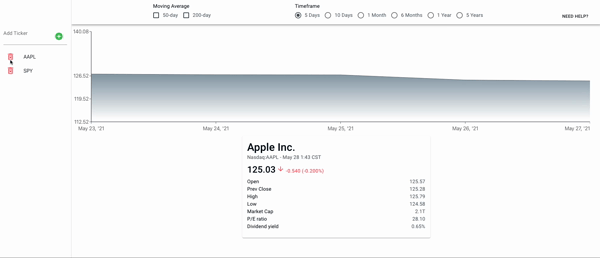
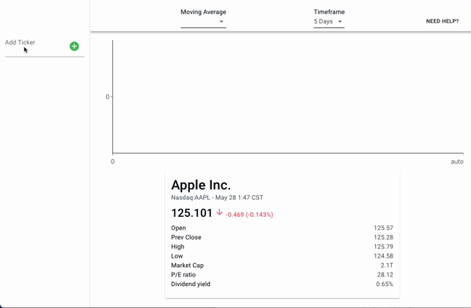

# Stock Tracker

Stock Tracker is an app that allows users to track stock performance of the companies, ETFs and indexes they choose.

Link to it here...

## Usage

You will need to disable CORS in your browser before it will work.  
A plugin is required if using Chrome or Firefox. See here for Chrome and here for Firefox.
If using Safari, you can disable CORS directly in the Develop menu. See here for instructions how.

## Initial Setup

By default, you will have AAPL in your watchlist. To delete it, or any ticker you choose to add, simply click on the trash can icon next to it.

## Adding Tickers

To add a ticker, just enter the symbol in the upper-left input line and press the enter key or click on the green '+' sign. Do not worry about adding invalid tickers, it will not allow you to do that.

## Viewing Data

To view details of a ticker in your watchlist, just click on the ticker you would like to view. At the top of the screen, you can select moving averages which will be displayed as a single horizontal line across the chart. 50-day and 200-day moving averages are the current options. You can also select a timeframe of price history to view.

The current day's price activity as well as some other fundamental information about the company you have selected is displayed in a card at the bottom.

## Saving Your Watchlist

You do not need to manually save your watchlist. Instead, it will be saved to your browser's local storage by default.
